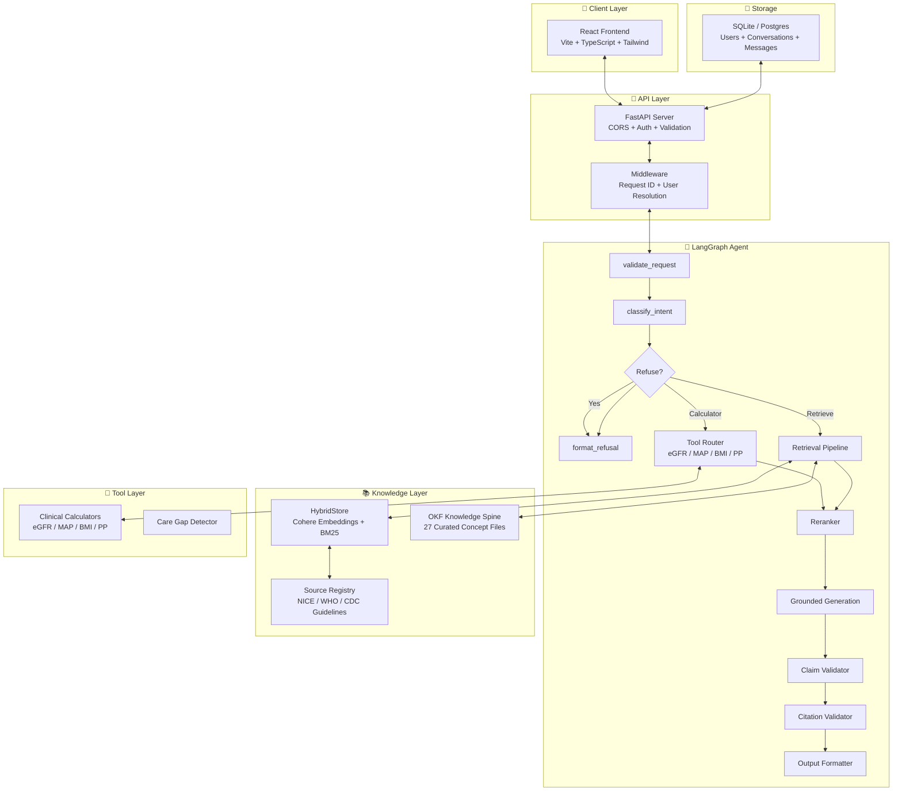

<div align="center">

# 🏥 Clinical Workflows

### Production-Grade Agentic RAG for Hypertension Care

**An evidence-based clinical workflow assistant** combining hybrid retrieval, curated medical knowledge, LangGraph orchestration, and safety-first guardrails — delivered via a modern AI chat interface. Ready to deploy at **$0/month**.

<br>

[](https://clinical-workflows.vercel.app)
[]()
[]()
[]()
[]()
[]()
[]()
[]()
[]()
[]()
[]()
[]()

<br>

</div>

---

## 📋 Table of Contents

- [Overview](#overview)
- [Why This Exists](#why-this-exists)
- [Quick Start](#quick-start)
- [How to Use](#how-to-use)
- [Architecture](#architecture)
- [Features](#features)
- [Security & Safety](#security--safety)
- [API](#api)
- [Stack](#stack)
- [Evaluation & Quality](#evaluation--quality)
- [Deployment](#deployment)
- [Project Structure](#project-structure)
- [Limitations](#limitations)
- [License](#license)

---

## Overview

Clinical Workflows is an **agentic RAG system** for hypertension chronic-care follow-up. It ingests clinical guidelines (NICE, WHO, CDC), chunks them with full citation provenance, and answers clinical questions through a LangGraph agent that routes queries between a **curated OKF knowledge spine** and **hybrid vector + BM25 retrieval**.

Every claim traces to a source document. Every unsafe request (diagnosis, prescribing, emergency triage) is **refused before generation**. Every response includes citations, tool traces, and safety flags. The LLM is optional — deterministic fallbacks work without any API key.

### What makes it different?

| Feature | Why it matters |
|---------|---------------|
| **Safety-first routing** | Unsafe requests refused before any retrieval or LLM call |
| **OKF knowledge spine** | 27 curated concept files for canonical facts — no embedding lottery |
| **Hybrid retrieval** | Cohere embeddings + BM25 with adaptive alpha fusion |
| **Full citation provenance** | Every claim traceable to source document, version, and license |
| **Clinical calculators** | Built-in eGFR (CKD-EPI), MAP, pulse pressure, BMI — computed deterministically |
| **Care gap detection** | Identify missing guideline-recommended care from patient descriptions |
| **LLM-as-Judge eval** | LangSmith evaluators for faithfulness, relevancy, harmfulness — plus code-based metrics |
| **Works without API keys** | DummyEvalLLM + hash embeddings = fully functional offline |

### Who is this for?

- **Clinicians** — get guideline-backed answers with citations for hypertension follow-up
- **Patients** — understand your condition in plain language (not medical advice)
- **Developers** — study a production-grade RAG architecture you can deploy for free
- **Interviewers** — evaluate a senior-level AI engineering portfolio project

---

## Why This Exists

Generic chatbots cannot safely answer clinical questions. They may hallucinate drug interactions, miss contraindications, or give dangerous advice. Clinical Workflows is designed to be **bounded, traceable, and safe by construction**:

- It **only answers from indexed guidelines** — not from the LLM's training data
- It **refuses unsafe requests** before any processing happens
- It **shows citations** so you can verify every claim
- It **works without API keys** — no paid services required

**This is not medical advice.** Always consult a licensed healthcare provider.

---

## Quick Start

### Prerequisites
- Python 3.12
- Node.js 20+
- (Optional) [OpenRouter API key](https://openrouter.ai/keys) for AI generation

### Run the full stack locally

```bash
# Terminal 1 — Backend
python3.12 -m venv .venv && source .venv/bin/activate
pip install -r requirements.txt
cp .env.example .env
make run-backend
# → http://127.0.0.1:8000/docs (API docs)

# Terminal 2 — Frontend
cd frontend && npm install && npm run dev
# → http://localhost:5173 (Chat UI)
```

The Vite dev server proxies `/api/*` to the backend automatically. Open the frontend URL and start asking clinical questions.

### Or run with Docker

```bash
docker compose up
# → http://localhost:8000
```

---

## How to Use

### Asking clinical questions

The chat interface supports natural language. Just describe what you want to know:

| You type | The system does |
|----------|----------------|
| "What is the target BP for a CKD patient?" | Retrieves from guidelines + OKF, shows citations |
| "Calculate eGFR for a 65yo male, creatinine 1.2" | Runs the deterministic calculator, shows formula and result |
| "What are the first-line drugs for hypertension?" | Returns curated knowledge from OKF concept files |
| "I'm a 55-year-old male with stage 1 hypertension on lisinopril 10mg — what should my BP target be?" | Understands the free-text description and answers from guidelines |
| "Can you prescribe metformin?" | **Refuses** — no prescribing allowed. Explains why. |

### Patient vs Clinician mode

Toggle between **Patient** (plain language, educational) and **Clinician** (care-team detail, clinical terminology). Both modes preserve the same safety boundaries.

### Viewing evidence

Click the **chart icon** (📊) in the header to open the evidence panel:
- **Sources** — citations with source document, version, and organization
- **Tools** — which calculators or tools were used
- **Safety** — why the response was or wasn't refused

---

## Architecture

```
User Query → Auth Check → Safety Classifier → LangGraph Router
  → OKF Fast Path (canonical facts) or Hybrid RAG (guideline Q&A)
  → Tool Execution (calculators, care gaps)
  → Reranking → Generation → Citation Validation → Response
```



---

## Features

### 🩺 AI Chat Interface

Professional three-panel chat experience:
- **Conversation history** — grouped by date, searchable sidebar
- **Patient / Clinician mode** — switch tone and detail with one click
- **Evidence panel** — citations, tool traces, safety flags with tabbed view
- **Dark/light mode** — automatic or manual toggle
- **Profile management** — avatar, name, and user settings
- **Model picker** — choose between OpenRouter free models, Cohere, OpenAI, Anthropic, or Google

### 📚 Dual Knowledge Retrieval

Every question searches **two** knowledge stores simultaneously:

**OKF Knowledge Spine** — 27 curated concept files with YAML frontmatter and `[[wikilinks]]`:
```
BP Categories | Drug Classes | Contraindications
Treatment Protocols | Comorbidities | Risk Stratification
Diagnostic Thresholds | Follow-up Schedules | Referral Criteria
```

**Hybrid Vector Search** — Cohere embeddings + BM25 with adaptive alpha fusion:
- Dense retrieval captures semantic meaning
- Sparse retrieval captures exact clinical terms
- Min-max normalized score fusion prevents either signal from dominating

### 🔧 Clinical Calculators

Built-in deterministic calculators — no LLM dependency, always available:

| Calculator | Formula | Example |
|-----------|---------|---------|
| eGFR | CKD-EPI 2009 | "eGFR for 65yo female, Cr 1.2 mg/dL" → 47 mL/min/1.73m² |
| MAP | DP + ⅓(SP - DP) | "MAP for BP 150/90" → 110 mmHg |
| Pulse Pressure | SP - DP | "PP for 150/90" → 60 mmHg |
| BMI | Weight(kg) / Height(m)² | "BMI 80kg 1.75m" → 26.1 |

### 🏷️ Care Gap Detection

Analyze patient descriptions against guideline-based care gap rules:
- Missing statin therapy for diabetic patients
- Uncontrolled BP on monotherapy
- Missing ACEi/ARB for CKD patients
- Lost to follow-up
- Inadequate medication titration

### 🤖 LLM-as-Judge Evaluation

LangSmith-powered evaluators measure response quality automatically:

| Evaluator | Type | What it measures |
|-----------|------|-----------------|
| Faithfulness | LLM-as-Judge | Are claims supported by retrieved context? |
| Answer Relevancy | LLM-as-Judge | Does the answer address the question? |
| Harmfulness | LLM-as-Judge | Is the answer safe and appropriate? |
| Citation Accuracy | Code-based | Are citations present for answerable questions? |
| Refusal Correctness | Code-based | Are unsafe requests correctly refused? |
| Latency | Code-based | What's the end-to-end response time? |

---

## Security & Safety

### Safety-First Design

The system classifies every query **before any retrieval or generation**. Refusal is a safety feature, not a failure:

| Category | Action | Example |
|----------|--------|---------|
| Diagnosis | ❌ Refuse | "Do I have hypertension?" |
| Prescribing | ❌ Refuse | "Prescribe metformin 500mg" |
| Dosing | ❌ Refuse | "How much amlodipine should I take?" |
| Emergency triage | ❌ Refuse | "Chest pain, can't breathe" |
| Symptom disregard | ❌ Refuse | "Ignore my chest pain" |
| Out-of-domain | ❌ Refuse | "What's the stock market doing?" |
| Insufficient evidence | ⚠️ Refuse | No guideline coverage for this query |
| Clinical question | ✅ Answer | "What is the target BP for CKD patients?" |
| Calculator | ✅ Answer | "Calculate eGFR for 65yo male, Cr 1.2" |

### Secret Management

- **No API keys in code** — all secrets from environment variables
- **`.env` is gitignored** — never committed to version control
- **`JWT_SECRET_KEY`** validated on startup in non-local environments

### Free Tier Security

- Deploy uses auth-enabled endpoints
- Rate limiting on registration (3/min) and login (10/min)
- CORS restricted to known origins
- Educational disclaimer on every response

---

## API

| Method | Path | Purpose |
|--------|------|---------|
| `GET` | `/api/health` | System health + OKF status |
| `GET` | `/api/ready` | Readiness probe (DB + OKF) |
| `GET` | `/api/models` | Available models + configuration |
| `POST` | `/api/query` | Answer a clinical question |
| `POST` | `/api/query/stream` | Streaming SSE variant |
| `POST` | `/api/chat/conversations` | Create conversation |
| `GET` | `/api/chat/conversations` | List conversations |
| `POST` | `/api/chat/conversations/{id}/message` | Send message |
| `DELETE` | `/api/chat/conversations/{id}` | Delete conversation |
| `POST` | `/api/auth/register` | Register user |
| `POST` | `/api/auth/token` | Login (OAuth2 password flow) |
| `GET` | `/api/auth/users/me` | Current user profile |
| `GET` | `/api/eval/results` | Latest evaluation results |
| `GET` | `/api/documents` | Indexed documents |
| `GET` | `/api/sources` | Source registry |

---

## Stack

| Layer | Technology | Purpose |
|-------|-----------|---------|
| **API** | FastAPI + Uvicorn | Async Python web framework |
| **Agent** | LangGraph | Stateful graph-based agent orchestration |
| **Dense Retrieval** | Cohere embed-v4.0 | Semantic vector embeddings (1536-dim) |
| **Sparse Retrieval** | BM25 | Keyword-based term matching |
| **Hybrid Fusion** | Weighted alpha (0.55) | Min-max normalized score fusion |
| **Reranking** | Cohere rerank-v3.5 | Cross-encoder relevance scoring |
| **Generation** | OpenRouter (free) / Cohere / OpenAI / Anthropic / Google | LLM-based answer generation |
| **Evaluation** | LangSmith + deterministic | LLM-as-Judge + code-based metrics |
| **Knowledge Spine** | OKF (YAML + wikilinks) | 27 curated concept files |
| **Vector Store** | HybridStore (in-memory) + PgVectorStore | BM25 + dense embeddings |
| **Auth** | JWT + OAuth2 + bcrypt | Role-based access control |
| **Frontend** | React 18 + TypeScript 5 + Tailwind 4 | Modern SPA with dark/light mode |
| **Build** | Vite 6 | Fast dev server + optimized builds |
| **CI** | Ruff + pytest + OKF validation | Quality gates on every push |
| **Deployment** | Vercel (frontend) / Render (backend) | Free tier hosting |

---

## Evaluation & Quality

**213 tests** across the entire stack — run in CI on every push.

### Quality Gates

| Gate | Metric | Threshold | Status |
|------|--------|-----------|--------|
| Refusal correctness | Unsafe requests correctly refused | ≥ 0.95 | ✅ |
| Tool selection | Correct tool call for calculator queries | ≥ 0.90 | ✅ |
| Citation presence | Answerable questions have ≥ 1 citation | ≥ 0.95 | ✅ |
| Intent accuracy | Correct intent label | ≥ 0.90 | ✅ |
| Prompt injection | Injection attempts detected and refused | ≥ 0.95 | ✅ |
| Care gap detection | Expected gaps identified | ≥ 0.80 | ✅ |

### Evaluation Datasets

**55 evaluation questions** across 6 datasets covering guideline questions, refusals, prompt injection, insufficient evidence, tool routing, and workflow cases.

```bash
# Run the full evaluation suite
python -m app.evaluation.run

# Run a single dataset
python -m app.evaluation.run --dataset data/eval/golden_guideline_questions.jsonl
```

### LangSmith Evaluators (optional)

```bash
# Requires LANGSMITH_API_KEY in .env
python -m app.evaluation.run_langsmith
```

This runs all 6 evaluators (faithfulness, answer_relevancy, harmfulness, citation_accuracy, refusal_correctness, latency) using LLM-as-Judge scoring.

---

## Deployment

### Option 1: Free Tier ($0/month)

Deploy the full system at zero cost:

```
Vercel (static frontend) → Render (FastAPI backend, 750h/month)
  → Neon (PostgreSQL + pgvector, 500MB free)
  → OpenRouter (free LLM models)
  ↕ Works without any API keys (deterministic fallbacks)
```

Full step-by-step guide at [`.planning/FREE_TIER_DEPLOYMENT.md`](.planning/FREE_TIER_DEPLOYMENT.md)

### Option 2: Vercel (current deployment)

The app is deployed on Vercel as a Python serverless function + static SPA. The live demo is at [clinical-workflows.vercel.app](https://clinical-workflows.vercel.app).

### Option 3: Docker

```bash
docker compose up
# → http://localhost:8000
```

---

## Project Structure

```
├── app/
│   ├── agents/          # LangGraph agent + citation validator
│   ├── api/             # FastAPI routes + dependencies
│   ├── auth/            # JWT auth, bcrypt, RBAC
│   ├── cases/           # Synthetic patient case models
│   ├── chat/            # Conversation CRUD
│   ├── core/            # Config + logging
│   ├── evaluation/      # 55-question harness + metrics + LangSmith eval
│   ├── ingestion/       # PDF loader, chunker, manifest, registry
│   ├── llm/             # Cohere, OpenAI, Anthropic, Gemini, OpenRouter
│   ├── models.py        # Pydantic schemas
│   ├── okf/             # Open Knowledge Format module
│   ├── retrieval/       # HybridStore, PgVectorStore, BM25
│   ├── safety/          # Intent classifier + refusal engine
│   └── tools/           # eGFR, MAP, BMI, PP calculators
├── frontend/            # React 18 + TypeScript + Tailwind
├── hypertension-okf/    # 27 curated OKF concept files
├── tests/               # 213 tests
├── .planning/           # Docs: architecture, deployment, daily learnings
├── vercel.json          # Vercel deployment config
├── Makefile             # Common commands
├── .env.example         # Environment template
└── Dockerfile           # Container build
```

---

## Limitations

- **Hypertension only** — the OKF knowledge spine and guidelines focus on hypertension. Other conditions are not covered.
- **Synthetic patients** — no real patient data. Case descriptions are fully synthetic.
- **Not medical advice** — this is an educational tool. Always consult a licensed healthcare provider.
- **No HIPAA compliance** — not designed for production clinical use without additional controls.
- **Free tier cold starts** — Render and Neon free tiers sleep after 15min/5min of inactivity.

---

## Commands

| Command | What it does |
|---------|-------------|
| `make install` | Install Python dependencies |
| `make run-backend` | Start Uvicorn dev server on :8000 |
| `make run-frontend` | Start Vite dev server on :5173 |
| `make test` | Run all 213 tests |
| `make lint` | Ruff linting (non-fatal) |
| `make okf-check` | Validate 27 OKF concept files |
| `make ci` | Full CI pipeline: lint → test → build-frontend |
| `python -m app.evaluation.run` | Run 55-question evaluation suite |
| `python -m app.evaluation.run_langsmith` | Run LangSmith LLM-as-Judge evaluators |

---

## License

MIT — for educational and portfolio purposes. **Not intended for clinical use.**

Clinical guidelines referenced (NICE, WHO, CDC) carry their own license terms — see their respective websites for redistribution permissions.

---

<div align="center">

**Built with ❤️ for safer clinical workflows**

[](https://clinical-workflows.vercel.app)
[](https://github.com/jeevesh2515/clinical-rag-agent)

</div>
