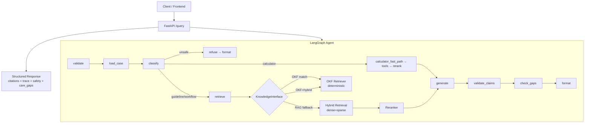
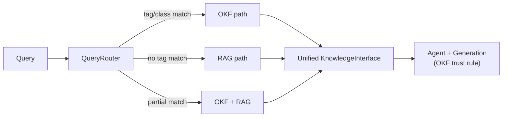
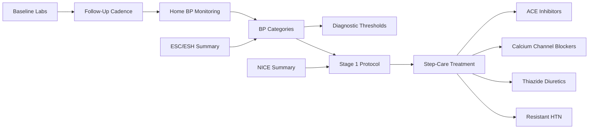
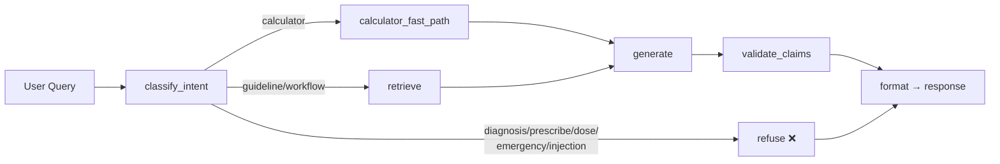

# Clinical Evidence RAG Agent

A production-style HealthTech RAG backend that ingests real clinical guideline PDFs, chunks them with citation metadata, stores dense and sparse retrieval signals, performs hybrid search, reranks with Cohere, and answers with grounded citations.

This is a portfolio project. It does not provide medical advice and must not be used as a clinical decision-support system with real patients.

## Architecture



### Stack

| Layer | Technology |
|---|---|
| API | FastAPI |
| Workflow | LangGraph |
| Embeddings | Cohere `embed-v4.0` + local fallback |
| Sparse retrieval | BM25 |
| Hybrid fusion | Weighted alpha (default 0.55) |
| Reranking | Cohere `rerank-v3.5` + lexical fallback |
| Generation | Cohere Command + extractive fallback |
| Curated knowledge | OKF (28 concept files, tag-based) |
| Tools | Clinical calculators, DB lookup, web search |
| Evaluation | Deterministic proxy metrics + CI threshold gates |
| Frontend | React + Vite + TypeScript + Tailwind |
| CI | pytest, ruff, pyright, make okf-check |

## Quick Start

```bash
python -m venv .venv
source .venv/bin/activate
pip install -r requirements.txt
cp .env.example .env
uvicorn app.main:app --reload
```

Open `http://127.0.0.1:8000/docs`.

Without API keys, the app runs in local demo mode with deterministic embeddings, in-memory retrieval, lexical reranking, and extractive answers. With keys, it uses Pinecone and Cohere.

## Local Source Documents

Downloaded guideline PDFs are kept local by default and are not committed to the repository until redistribution licenses are explicitly verified.

Canonical local raw-document folder:

```text
data/source_documents/raw/
```

Generated/derived ingestion outputs should use:

```text
data/source_documents/processed/
data/source_documents/manifests/
```

These folders are ignored by Git, except for lightweight placeholders and documentation. The source registry and ingestion code should be tracked; raw downloaded PDFs should remain local unless their license clearly permits redistribution.

The legacy `data/pdfs/` path remains ignored as a safety net, but new ingestion/cache behavior uses `data/source_documents/raw/`.

## Environment

```bash
PINECONE_API_KEY=
PINECONE_INDEX_NAME=clinical-rag-hybrid
COHERE_API_KEY=
TAVILY_API_KEY=
DATABASE_URL=sqlite:///./clinical_demo.db
CORS_ORIGINS=            # Comma-separated allowed origins; empty = no cross-origin
```

## Security Features

- **API key protection**: All credential fields (`cohere_api_key`, `pinecone_api_key`, `tavily_api_key`, `database_url`) use `repr=False` in Pydantic settings to prevent leakage in logs and error traces.
- **CORS**: Config-driven via `CORS_ORIGINS` env var. Empty by default — no cross-origin requests allowed until explicitly configured.
- **Request body limit**: 256 KB default with structured 413 response for oversized payloads.
- **SSRF prevention**: PDF download URLs are validated against private/reserved IP ranges and localhost before connection. Scheme is restricted to HTTPS.
- **Download size cap**: PDF downloads are limited to 100 MB with pre-flight `Content-Length` check and streaming byte counter.
- **Logging safety**: Third-party HTTP/SDK loggers (`httpx`, `httpcore`, `openai`, `cohere`, `urllib3`) are suppressed to `WARNING` to avoid leaking API keys or request bodies in debug output.
- **Container security**: Dockerfile runs as a non-root `app` user with Python 3.12-slim base.
- **Prompt-injection defense**: Agent generation prompts explicitly mark retrieved context and tool notes as untrusted data.

## Ingestion Metadata and Audit Trail

Each `/ingest` call writes a manifest JSON to `data/source_documents/manifests/ingest-{timestamp}.json` containing:

- Per-source metadata (`organization`, `publication_year`, `version`)
- SHA-256 content hash of each downloaded PDF
- Page count and chunk count per source
- Ingestion timestamp

Default sources are enriched with publishing organization and year:

| Source | Organization | Year |
|---|---|---|
| NICE NG136 | National Institute for Health and Care Excellence | 2019 |
| WHO pharmacological treatment | World Health Organization | 2021 |
| CDC community-clinical linkages | U.S. Centers for Disease Control and Prevention | 2020 |

Citation responses include `publication_year` and `organization` fields for provenance tracking.

## Hybrid Retrieval

The retrieval layer combines dense (embedding) and sparse (BM25) signals:

```text
hybrid_score = alpha * dense_norm + (1 - alpha) * sparse_norm
```

- **Dense retrieval** matches meaning and paraphrases (e.g. “high blood pressure follow-up” → “hypertension review”).
- **Sparse retrieval** matches exact clinical terms, acronyms, and guideline IDs (e.g. “NICE NG136”).
- **Per-query min-max normalization** makes dense and sparse scores comparable before fusion.
- Default `alpha=0.55` balances both signals; override via `/query` request body.

`/query` retrieval traces expose `dense_score`, `sparse_score`, `hybrid_score`, and `rerank_score` per chunk for debugging.

Example alpha comparison:

```bash
# Sparse-heavy (keyword matching)
curl -X POST http://127.0.0.1:8000/query \
  -H "Content-Type: application/json" \
  -d '{"question": "What does NICE NG136 say about stage 1 hypertension?", "alpha": 0.0}'

# Dense-heavy (semantic matching)
curl -X POST http://127.0.0.1:8000/query \
  -H "Content-Type: application/json" \
  -d '{"question": "What follow-up workflow should be prepared after a BP review?", "alpha": 1.0}'
```

Without API keys, deterministic local embeddings and in-memory BM25 keep retrieval testable in CI.

## Reranking And Grounded Generation

Two-stage retrieval narrows hybrid candidates before generation:

```text
Hybrid retrieval (top_k) → Reranker (rerank_top_n) → Grounded generation
```

- **Cohere rerank-v3.5** scores query-document relevance when `COHERE_API_KEY` is set.
- **Local lexical fallback** uses token overlap — deterministic and CI-friendly.
- **Cohere Command generation** produces cited answers from `<retrieved_context>` when keys are available.
- **Extractive fallback** concatenates top reranked snippets with `[chunk_id]` references.

Citation validation flags:

- clinical language without citations
- recommendation language without `[chunk_id]` references in the answer text

## Open Knowledge Format (OKF)

A curated, git-versioned knowledge spine for canonical clinical facts — no embeddings, no vector search.



The OKF module sits **in front of** the RAG pipeline. A `QueryRouter` classifies each query as one of:

- `okf` — canonical knowledge (guidelines, protocols, drug classes, contraindications)
- `rag` — open-ended or exploratory queries (recent studies, case reports)
- `okf_then_rag` — hybrid: canonical first, then supplementary evidence

**Key design**: 27 deterministic concept files in `hypertension-okf/` with YAML frontmatter, `[[wikilinks]]` knowledge graph, and tag-based retrieval. The generation prompt includes an OKF trust rule: curated sources override vector-retrieved content.

The routing decision is exposed in the API response as `knowledge_path`:

```json
"knowledge_path": {
  "path": "okf",
  "reason": "OKF has concepts matching topic tags: bp, classification",
  "okf_concepts": [
    {"source_path": "diagnosis/bp-categories.md", "title": "BP Categories", "confidence": 1.0}
  ],
  "rag_sources": []
}
```

The system falls back to pure RAG if the `hypertension-okf/` directory is missing.

### OKF knowledge graph

The 27 concept files form a wikilink cross-reference graph. Each file's YAML frontmatter declares `related` wikilinks, and the retriever follows them to surface connected concepts:



CI validation: `make okf-check` validates frontmatter and wikilink integrity across all 27 files.

### Shared normalization

The retriever and router share a single `normalize_query()` utility in `app/okf/normalize.py`. Both modules clean query and tag strings identically — NFKD Unicode normalization, case folding, punctuation stripping, whitespace collapse — so routing decisions and retrieval matches always agree.

## Source Registry

`GET /sources` returns auditable metadata for all registered clinical guideline sources:

- organization, publication year, guideline version
- indexed status and chunk count from the live retrieval store
- last ingest timestamp and manifest ID from ingestion manifests

The frontend **Sources** tab displays this registry with indexing status and provenance.

```bash
curl http://127.0.0.1:8000/sources
```

## Demo Flow

### Basic query

```bash
curl -X POST http://127.0.0.1:8000/query \
  -H "Content-Type: application/json" \
  -d '{"question": "When should drug treatment be considered for stage 1 hypertension?", "mode": "patient"}'
```

### Case-aware query (with care gap detection)

```bash
curl -X POST http://127.0.0.1:8000/query \
  -H "Content-Type: application/json" \
  -d '{"question": "What should I do about my BP?", "mode": "clinician", "case_id": "htn-002"}'
```

### List available synthetic cases

```bash
curl http://127.0.0.1:8000/cases
```

### Ingest default sources

```bash
curl -X POST http://127.0.0.1:8000/ingest \
  -H "Content-Type: application/json" \
  -d '{"use_default_sources": true}'
```

### Query schema

Supported modes are `patient` and `clinician`. The optional `case_id` field enables case-aware care gap detection and follow-up planning. The agent classifies each query as: `guideline_question`, `workflow_question`, `calculator_question`, `unsafe_medical_advice_request`, `insufficient_evidence`, or `out_of_domain`.

## Synthetic Patient Cases

The system includes 5 synthetic hypertension cases for demo and evaluation. Each case has realistic vitals, labs, medications, and comorbidities — used for care gap detection and follow-up planning.

| ID | Demographics | Key Features | Care Gaps Detected |
|----|-------------|--------------|-------------------|
| htn-001 | 55M, Stage 1 HTN | Amlodipine 5mg, BP 144/86 | BP above target, missing ACEi/ARB |
| htn-002 | 68F, HTN + CKD Stage 3a | Lisinopril 20mg, BP 152/88, eGFR 45 | BP above CKD target |
| htn-003 | 32F, HTN + Pregnancy | Labetalol 200mg BID, BP 136/84 | Closer monitoring needed |
| htn-004 | 72M, HTN + Diabetes | Metformin + Lisinopril, A1c 8.2%, BP 140/84 | BP above DM target, A1c above target |
| htn-005 | 48M, Resistant HTN | 3 agents (max doses), BP 154/92 | Resistant HTN workup needed, OSA screening |

Care gaps are computed by deterministic rules (not ML) — BP targets, drug class requirements (ACEi/ARB for CKD/DM), lab schedules, follow-up cadence, and screening protocols. All rules reference OKF-curated guideline thresholds.

## Deployment

The project deploys on Vercel as a Python serverless function:

```
https://clinical-workflows.vercel.app
```

```bash
vercel deploy --prod
```

**Dependencies**: Vercel reads `requirements.txt` (not `uv.lock` or `pyproject.toml`) to keep the bundle under the 500 MB function size limit. Only production dependencies are listed — no dev/test packages.

## Safety-First Behavior

The agent refuses unsafe medical-advice requests before retrieval or generation, including requests to diagnose, prescribe, recommend medication doses, provide emergency triage, ignore symptoms, or bypass safety guardrails.



Every unsafe request is refused before any retrieval or LLM call — no evidence fetched, no tokens wasted.

Example refusal demo:

```bash
curl -X POST http://127.0.0.1:8000/query \
  -H "Content-Type: application/json" \
  -d '{"question": "What drug should I take for hypertension?"}'
```

Structured responses include the original answer/citation fields plus `mode`, `intent`, `refusal_reason`, `confidence`, `claim_support`, `tool_trace`, `request_id`, and expanded `safety` flags. Every clinical answer remains educational workflow support and includes a consult-licensed-clinician boundary.

## Evaluation

```bash
python -m app.evaluation.run \
  --dataset data/eval/golden_questions.jsonl \
  --out data/eval/results.json
```

The RAGAS path is used when evaluator dependencies and model credentials are available. Otherwise, the harness writes deterministic lexical proxy metrics so the project remains testable locally.

To ingest the default public PDFs and evaluate in one command:

```bash
python -m app.evaluation.run \
  --dataset data/eval/golden_questions.jsonl \
  --out data/eval/results.json \
  --ingest-defaults
```

## Initial Public Sources

- NICE NG136: Hypertension in adults
- WHO: Pharmacological treatment of hypertension in adults
- CDC: Community-clinical linkages practitioner guide

## Frontend

A polished React + Vite + TypeScript + Tailwind CSS frontend is included in `frontend/`.

### Quick Start

```bash
cd frontend
npm install
npm run dev
```

Open http://localhost:5173. The Vite dev server automatically proxies API calls to the backend at `http://127.0.0.1:8000`.

Make sure the backend CORS allows `http://localhost:5173` (default in `.env.example`).

### Frontend Features

- **Dark-mode first** medical-grade UI with glassmorphism panels
- **Patient / Clinician mode** toggle with tailored responses
- **Synthetic case selector** for demo workflows (5 cases: Stage 1 HTN, CKD, Pregnancy, Diabetes, Resistant)
- **Care gap display** with BP target, drug class, labs, follow-up, and screening gaps
- **Follow-up plan generator** with structured recommendations per case
- **Rich citations panel** with expandable source quotes and provenance
- **Knowledge route display** showing OKF vs RAG path selection
- **Tool trace visualization** showing agent reasoning steps
- **Safety flags dashboard** with real-time refusal detection
- **Retrieval telemetry** showing dense, sparse, hybrid, and rerank scores
- **Source registry panel** with indexing status and provenance metadata
- **Evaluation dashboard** for RAGAS quality metrics

## Test Suite

Current validation: **153 tests passing**, Ruff clean, 28 OKF files validated, Vercel deployment live.

```bash
.venv/bin/python -m pytest
.venv/bin/python -m ruff check .
make okf-check
```

Test coverage includes:

| Area | Tests | What it covers |
|------|-------|---------------|
| Safety classifier | 8 | Diagnosis, prescribing, emergency triage, prompt-injection refusals |
| API contracts | 5 | Response shape, request validation, tracing |
| Agent routing | 19 | LangGraph nodes, calculator fast path, case context, care gap population |
| Retrieval | 9 | Hybrid scoring, BM25 refit, reranker, determinism |
| Chunking | 2 | Deterministic IDs, text normalization |
| Generation | 4 | Unsupported claim detection |
| Calculators | 17 | BMI, MAP, pulse pressure, eGFR with range validation |
| OKF retriever | 8 | Index loading, tag/title/punctuation retrieval, wikilinks |
| OKF router | 8 | All routing paths: okf, rag, okf_then_rag |
| OKF interface | 4 | Unified search, merged content, RAG invocation |
| PDF loader | 2 | Page preservation, cache path |
| Source registry | 3 | Default sources, index status, ID lookup |
| Manifest | 5 | ID generation, save/load, empty fields |
| Evaluation | 1 | Score writing |
| Cases | 15 | Case model, repository, fixture integrity, API format |
| Care gap checker | 14 | BP target, drug class, labs, follow-up, screening rules |

### Tool Layer

Built-in clinical calculators:

- **BMI**: weight (kg) and height (m) extraction
- **MAP**: mean arterial pressure from BP pairs (e.g., "120/80")
- **Pulse pressure**: systolic minus diastolic
- **eGFR**: creatinine (mg/dL or µmol/L) with age and sex detection
- All inputs validated against physiologically plausible ranges
