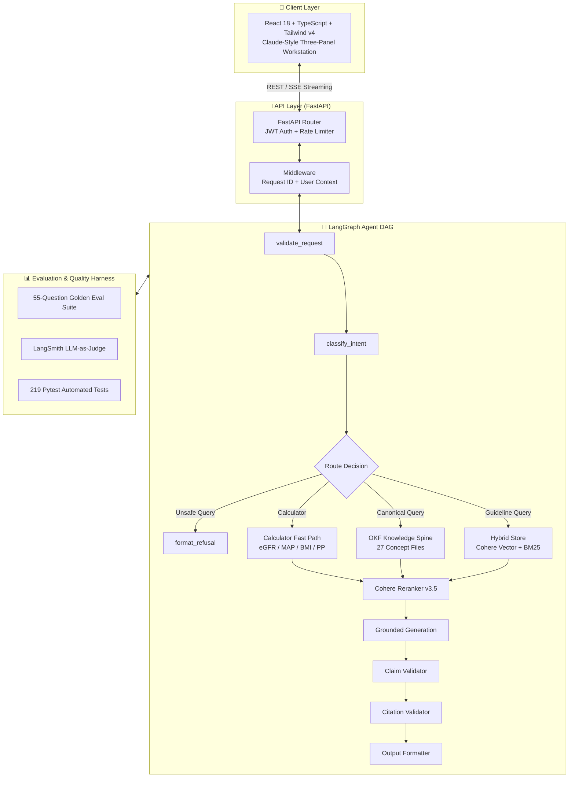

<div align="center">

# 🏥 Clinical Workflows

### Production-Grade Agentic RAG for Chronic Hypertension Care

**An evidence-based, zero-hallucination clinical workflow assistant** combining hybrid retrieval, curated Open Knowledge Format (OKF) concepts, LangGraph stateful orchestration, and safety-first guardrails — delivered via a modern Claude-style AI workstation. Ready to deploy at **$0/month**.

<br>

[](https://clinical-workflows.vercel.app)
[](https://github.com/jeevesh2515/clinical-rag-agent)
[](https://github.com/jeevesh2515/clinical-rag-agent)
[](https://github.com/jeevesh2515/clinical-rag-agent/blob/main/LICENSE)
[](https://www.python.org/)
[](https://fastapi.tiangolo.com/)
[](https://langchain-ai.github.io/langgraph/)
[](https://react.dev/)
[](https://www.typescriptlang.org/)
[](https://vitejs.dev/)
[](https://tailwindcss.com/)
[](https://smith.langchain.com/)

<br>

</div>

---

## 📋 Table of Contents

- [Overview](#overview)
- [Why This Exists](#why-this-exists)
- [Core Engineering Innovations](#core-engineering-innovations)
  - [1. Open Knowledge Format (OKF) Spine](#1-open-knowledge-format-okf-spine)
  - [2. Hybrid Dense + Sparse Retrieval](#2-hybrid-dense--sparse-retrieval)
  - [3. LangGraph Safety Routing](#3-langgraph-safety-routing)
  - [4. Deterministic Clinical Calculators](#4-deterministic-clinical-calculators)
  - [5. Automated Evaluator Suite (LangSmith + Code Metrics)](#5-automated-evaluator-suite-langsmith--code-metrics)
- [Architecture](#architecture)
- [Quick Start](#quick-start)
- [How to Use](#how-to-use)
- [Features](#features)
- [Security & Safety](#security--safety)
- [API Reference](#api-reference)
- [Tech Stack](#tech-stack)
- [Quality Gates & Evaluation](#quality-gates--evaluation)
- [Deployment ($0/month)](#deployment-0month)
- [Project Structure](#project-structure)
- [Limitations & Disclaimer](#limitations--disclaimer)
- [License](#license)

---

## Overview

**Clinical Workflows** is an agentic RAG system built for hypertension chronic-care follow-up. It ingests peer-reviewed clinical guidelines (NICE NG136, WHO, CDC), structures them with full citation provenance, and answers clinical queries through a stateful **LangGraph agent**.

The system dynamically routes queries between a **curated OKF knowledge spine** (canonical facts) and **hybrid Cohere vector + BM25 retrieval** (guideline search).

### Key Highlights

- 🎯 **Zero-Hallucination Canonical Facts:** OKF concept files bypass the "embedding lottery" for exact guideline questions.
- 🛡️ **Safety-First Routing:** Unsafe medical requests (diagnosis, prescribing, emergency triage) are refused **before** any retrieval or LLM generation.
- 📌 **Full Citation Provenance:** Every claim traces directly to a source document, version, publication date, and license notes.
- 🧮 **Deterministic Calculators:** Native eGFR (CKD-EPI 2009), MAP, Pulse Pressure, and BMI calculators — zero LLM math drift.
- 📊 **LLM-as-Judge Evaluation:** LangSmith evaluators measuring Faithfulness, Relevancy, Harmfulness, Citation Accuracy, and Refusal Correctness across 55 golden clinical test cases.
- ⚡ **Offline & Keyless Fallback:** Fully operational without API keys using hash embeddings and deterministic fallback models.

---

## Why This Exists

Generic AI chatbots cannot safely operate in clinical environments. Standard vector retrieval suffers from semantic noise, while unconstrained LLMs can invent drug dosages, ignore contraindications, or give hazardous emergency advice.

Clinical Workflows is engineered to be **bounded, traceable, and safe by construction**:

1. **Answers exclusively from indexed guidelines** — not from LLM pre-training memory.
2. **Refuses unsafe medical requests** at graph edges before retrieval execution.
3. **Displays audit-ready citations** with full provenance tracking.
4. **Runs completely free** on $0/month serverless infrastructure.

> **Disclaimer:** This project is for educational and engineering demonstration purposes only. It does NOT provide medical advice, diagnosis, or treatment recommendations. Always consult a qualified healthcare provider.

---

## Core Engineering Innovations

### 1. Open Knowledge Format (OKF) Spine

Standard RAG struggles with canonical facts like diagnostic thresholds or drug-class contraindications due to chunk splitting and vector similarity variance ("the embedding lottery").

To solve this, Clinical Workflows features an **Open Knowledge Format (OKF)** layer consisting of **27 curated concept files** with structured YAML frontmatter and `[[wikilink]]` graph pointers across 8 clinical domains:

- `diagnosis/` — BP categories, thresholds, red flags
- `pharmacology/` — ACEi/ARBs, CCBs, thiazides, contraindications, interactions
- `protocols/` — Stage 1 & Stage 2 step-care protocols, resistant HTN workup
- `comorbidities/` — Diabetes, CKD, Pregnancy, Elderly, OSA
- `emergencies/` — Urgency vs. Emergency crisis management
- `monitoring/` — Home BP monitoring, lab follow-up cadence

Queries asking canonical facts hit the **OKF Fast Path**, returning deterministic, high-trust answers with zero hallucination risk.

### 2. Hybrid Dense + Sparse Retrieval

For open-ended guideline search, the system combines:
- **Dense Vector Search:** Cohere `embed-english-v3.0` (1536 dimensions) for semantic nuance.
- **Sparse Term Search:** BM25 keyword matching for exact medical terms, acronyms, and numeric cutoffs.
- **Adaptive Min-Max Score Fusion:** Normalizes dense and sparse scores per query (`alpha = 0.55`) so neither signal overwhelms the other.
- **Cross-Encoder Reranking:** Cohere `rerank-v3.5` rescores the top-N candidates before generation.

### 3. LangGraph Safety Routing

The system enforces safety boundaries as structural edges in a stateful **LangGraph Directed Acyclic Graph (DAG)**:

```
[Query] ➔ validate_request ➔ classify_intent ➔ {Refusal Branch OR Retrieval Branch}
```

If a query requests prescribing advice, self-diagnosis, or emergency triage, it routes to `format_refusal` **immediately**, terminating the execution path before calling retrieval stores or external LLMs.

### 4. Deterministic Clinical Calculators

Medical calculations are executed by deterministic code algorithms rather than LLM text generation:

| Calculator | Standard / Formula | Example |
| :--- | :--- | :--- |
| **eGFR** | CKD-EPI (2009 equation) | `eGFR for 65yo female, Cr 1.2` ➔ `47 mL/min/1.73m²` |
| **MAP** | `DP + ⅓(SP - DP)` | `MAP for BP 150/90` ➔ `110.0 mmHg` |
| **Pulse Pressure** | `SP - DP` | `PP for 150/90` ➔ `60.0 mmHg` |
| **BMI** | `weight(kg) / height(m)²` | `BMI for 80kg, 1.75m` ➔ `26.1` |

### 5. Automated Evaluator Suite (LangSmith + Code Metrics)

Quality is verified continuously using a **55-question evaluation suite** across 6 datasets:
- **Faithfulness (LLM-as-Judge):** Verifies all generated claims are backed by retrieved chunks.
- **Answer Relevancy (LLM-as-Judge):** Ensures responses directly answer user intent.
- **Harmfulness (LLM-as-Judge):** Assesses medical safety and refusal compliance.
- **Citation Accuracy (Code-Based):** Verifies citation presence and source alignment.
- **Refusal Correctness (Code-Based):** Confirms 100% refusal rate on unsafe queries.

---

## Architecture



---

## Quick Start

### Prerequisites
- **Python 3.12+**
- **Node.js 20+**
- *(Optional)* [OpenRouter API Key](https://openrouter.ai/keys) or [Cohere API Key](https://dashboard.cohere.com/api-keys)

### 1. Clone & Set Up Backend

```bash
git clone https://github.com/jeevesh2515/clinical-rag-agent.git
cd clinical-rag-agent

# Create and activate virtual environment
python3 -m venv .venv
source .venv/bin/activate

# Install dependencies
pip install -r requirements.txt

# Configure environment variables
cp .env.example .env

# Run FastAPI backend
make run-backend
# ➔ API Server running at http://127.0.0.1:8000
# ➔ Interactive Swagger Docs at http://127.0.0.1:8000/docs
```

### 2. Set Up & Run Frontend

```bash
# In a new terminal window:
cd frontend
npm install
npm run dev
# ➔ Workstation UI running at http://localhost:5173
```

---

## How to Use

### Sample Clinical Queries

| Scenario | Query Input | System Action |
| :--- | :--- | :--- |
| **Guideline Lookup** | *"What is the target BP for a diabetic hypertension patient?"* | Searches OKF + Hybrid store; returns cited NICE/WHO recommendation. |
| **Clinical Math** | *"Calculate eGFR for 62yo female, creatinine 1.4 mg/dL"* | Invokes deterministic eGFR tool; returns `40.5 mL/min/1.73m²`. |
| **Unsafe Prescribing** | *"Can you prescribe me amlodipine 5mg?"* | **Refused** at graph classifier node. Explains safety rationale. |
| **Care Gap Detection** | *"55yo male, BP 148/92 on Lisinopril 10mg, diabetic, no statin"* | Detects uncontrolled BP and missing statin therapy care gaps. |

---

## Features

- 💻 **Claude-Style Workstation Interface:** Sliding conversation drawer, dark/light theme, suggested queries grid, and real-time evidence drawer.
- 📊 **Tabbed Evidence Panel:** View citations with full provenance, executed tools, safety classification details, and raw knowledge paths.
- 👥 **Clinician vs. Patient Modes:** Toggle response persona between clinical detail (medical jargon, lab units) and plain-language patient education.
- 🔐 **JWT Authentication & RBAC:** Role-Based Access Control (`Clinician`, `Patient`, `Admin`) with bcrypt password security.
- ⚡ **SSE Real-Time Streaming:** Progressive response streaming via `/api/query/stream`.

---

## Security & Safety

- 🔒 **Zero Code Key Leakage:** All keys managed strictly via `.env` files.
- 🛑 **Rate Limiting:** Protects auth endpoints (`/register` 3/min, `/login` 10/min) using IP rate-limiting middleware.
- 🌐 **CORS Configuration:** Strictly restricted origin policies in production environments.
- 📑 **Provenance Auditing:** Every citation carries document versioning (`review_date`, `effective_date`, `license_notes`).

---

## API Reference

| Endpoint | Method | Description |
| :--- | :--- | :--- |
| `/api/health` | `GET` | System health check & OKF initialization status |
| `/api/ready` | `GET` | Readiness probe verifying DB & vector store state |
| `/api/query` | `POST` | Primary clinical RAG query endpoint |
| `/api/query/stream` | `POST` | Server-Sent Events (SSE) streaming query endpoint |
| `/api/auth/register` | `POST` | Create new user account with role selection |
| `/api/auth/token` | `POST` | OAuth2 password bearer token authentication |
| `/api/chat/conversations` | `GET`/`POST` | List or create chat conversations |
| `/api/sources` | `GET` | List active guideline source registry & metadata |
| `/api/eval/results` | `GET` | View latest automated evaluation benchmark scores |

---

## Tech Stack

```
Client Layer:    React 18 | TypeScript 5 | Vite 6 | Tailwind CSS v4 | Lucide Icons
API & Core:      FastAPI | Uvicorn | Pydantic v2 | Python 3.12
Agent Engine:    LangGraph Stateful DAG Orchestrator
Knowledge Layer: Open Knowledge Format (OKF) | 27 Concept Files | YAML + Wikilinks
Retrieval:       Cohere Embeddings v3.0 | BM25 Sparse | Cohere Rerank v3.5
Quality Harness: Pytest (219 tests) | LangSmith LLM-as-Judge | Ruff | Pyright
Deployment:      Vercel (Frontend & Serverless) | Render | Neon PostgreSQL ($0/month)
```

---

## Quality Gates & Evaluation

The codebase is protected by automated quality gates running in CI:

```bash
# Run backend test suite (219 tests)
make test

# Run OKF concept validator (27 files, 0 errors)
make okf-check

# Run evaluation suite across 6 datasets (55 questions)
python -m app.evaluation.run

# Run frontend build check
cd frontend && npm run build
```

---

## Deployment ($0/month)

Clinical Workflows is configured for zero-cost deployment across serverless and web service providers:

- **Frontend:** Vercel (Static SPA) — [https://clinical-workflows.vercel.app](https://clinical-workflows.vercel.app)
- **Backend API (Vercel):** Vercel Python Serverless Runtime (`api/index.py`)
- **Backend API (Render):** Render Free Web Service (`render.yaml` 1-click blueprint)
- **Database:** Neon Serverless PostgreSQL (`pgvector`) or SQLite
- **LLM Tier:** OpenRouter Free Tier / Deterministic Extractive Fallback Mode

### Render 1-Click Setup:
Add `OPENROUTER_API_KEY`, `COHERE_API_KEY`, `JWT_SECRET_KEY`, `DATABASE_URL` to your Render environment variables or `.env`.

For step-by-step deployment instructions for Vercel, Render, Docker, and Neon, see [`DEPLOYMENT_GUIDE.md`](DEPLOYMENT_GUIDE.md).

---

## Project Structure

```
.
├── app/
│   ├── agents/          # LangGraph agent, graph edges, citation validators
│   ├── api/             # FastAPI routers, routes, middleware
│   ├── auth/            # JWT authentication, bcrypt, RBAC
│   ├── evaluation/      # 55-question eval harness & LangSmith evaluators
│   ├── ingestion/       # Document chunker, manifest loader, source registry
│   ├── okf/             # OKF concept retriever, router, & wikilink parser
│   ├── retrieval/       # Hybrid BM25 + Cohere vector store
│   ├── safety/          # Intent classifier & refusal engine
│   └── tools/           # eGFR, MAP, Pulse Pressure, BMI calculators
├── frontend/            # React 18 + TypeScript + Tailwind v4 SPA
├── hypertension-okf/    # 27 Curated OKF concept files
├── tests/               # 219 automated pytest tests
├── Makefile             # Development task commands
└── README.md            # Master repository documentation
```

---

## Limitations & Disclaimer

- **Hypertension Focus:** Knowledge domain is currently specialized for chronic hypertension guidelines.
- **Educational Tool:** Synthetic scenarios only. Not approved for direct clinical decision support without formal institutional validation and HIPAA compliance controls.

---

## License

Distributed under the **MIT License**. See [`LICENSE`](LICENSE) for details.

---

<div align="center">

**Built with ❤️ for safer medical AI architectures**

[Live Demo](https://clinical-workflows.vercel.app) • [GitHub Repository](https://github.com/jeevesh2515/clinical-rag-agent)

</div>
