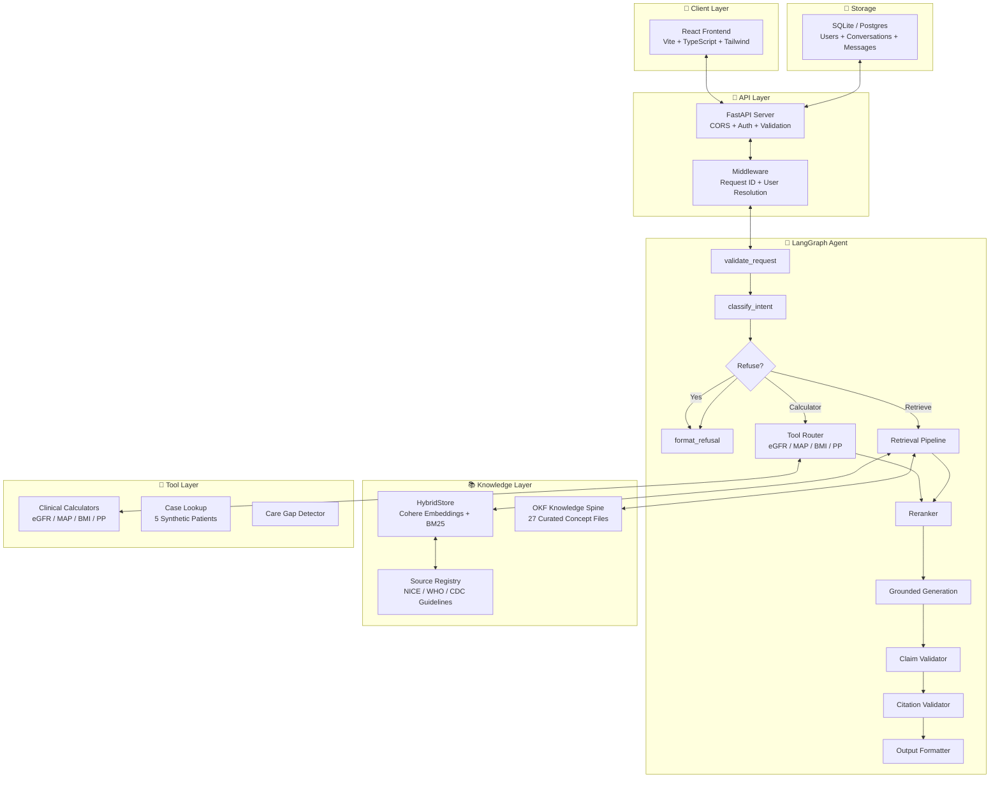

<div align="center">

# 🏥 Clinical Workflows

### Production-Grade Agentic RAG for Hypertension Care

**An evidence-based clinical workflow assistant** combining hybrid retrieval, curated medical knowledge, LangGraph orchestration, and safety-first guardrails — delivered via a modern AI chat interface.

<br>

[](https://clinical-workflows.vercel.app)
[]()
[]()
[]()
[]()
[]()
[]()
[]()
[]()
[]()

<br>

</div>

---

## 📋 Table of Contents

- [Overview](#overview)
- [Quick Start](#quick-start)
- [Architecture](#architecture)
- [Security & Safety](#security--safety)
- [Features](#features)
- [API](#api)
- [Stack](#stack)
- [Evaluation & Quality](#evaluation--quality)
- [Environment](#environment)
- [Project Structure](#project-structure)
- [License](#license)

---

## Overview

Clinical Workflows is an **agentic RAG system** for hypertension chronic-care. It ingests clinical guidelines (NICE, WHO, CDC), chunks them with full citation provenance, and answers clinical questions through a LangGraph agent that routes queries between a **curated OKF knowledge spine** and **hybrid vector + BM25 retrieval**.

Every claim is traced to a source document. Every unsafe request (diagnosis, prescribing, emergency triage) is **refused before generation**. Every response includes citations, tool traces, and safety flags.

### What makes it different?

| Feature | Why it matters |
|---------|---------------|
| **Safety-first routing** | Unsafe requests refused before any retrieval or LLM call |
| **OKF knowledge spine** | 27 curated concept files for canonical facts (BP categories, drug classes) — no embedding dependency |
| **Hybrid retrieval** | Cohere embeddings + BM25 with adaptive alpha fusion |
| **Full citation provenance** | Every claim traceable to source document, version, and license |
| **Clinical calculators** | Built-in eGFR (CKD-EPI), MAP, pulse pressure, and BMI — computed deterministically |
| **Care gap detection** | Identify missing guideline-recommended care from synthetic patient cases |
| **Structured observability** | Per-node latency breakdown, JSON-structured logs, streaming SSE |

---

## Quick Start

### Prerequisites
- Python 3.12
- Node.js 20+
- A free [OpenRouter API key](https://openrouter.ai/keys) (for AI generation)

### Backend

```bash
# Create virtual environment and install deps
python3.12 -m venv .venv && source .venv/bin/activate
pip install -r requirements.txt

# Configure environment
cp .env.example .env
# Edit .env — add your OPENROUTER_API_KEY at minimum

# Run the server
make run-backend
# → http://127.0.0.1:8000/docs
```

### Frontend

```bash
cd frontend
npm install
npm run dev
# → http://localhost:5173
```

The Vite dev server proxies `/api/*` to the backend automatically.

---

## Architecture



### Request Flow

```
User Query → Auth Check → Safety Classifier → LangGraph Router
  → OKF Fast Path (canonical facts) or Hybrid RAG (guideline Q&A)
  → Tool Execution (calculators, care gaps)
  → Reranking → Generation → Citation Validation → Response
```

---

## Security & Safety

### Safety-First Design

The system classifies every query before any retrieval or generation:

| Category | Action | Example |
|----------|--------|---------|
| Diagnosis | ❌ Refuse | "Do I have hypertension?" |
| Prescribing | ❌ Refuse | "Prescribe metformin 500mg" |
| Dosing | ❌ Refuse | "How much amlodipine should I take?" |
| Emergency triage | ❌ Refuse | "Chest pain, can't breathe" |
| Symptom disregard | ❌ Refuse | "Ignore my chest pain, what's normal BP?" |
| Out-of-domain | ❌ Refuse | "What's the stock market doing?" |
| Insufficient evidence | ⚠️ Refuse | No guideline coverage for query |
| Workflow question | ✅ Answer | "What is the target BP for CKD patients?" |
| Calculator | ✅ Answer | "Calculate eGFR for 65yo male, Cr 1.2 mg/dL" |

### Secret Management

- **No API keys in code** — all secrets loaded from environment variables
- **`.env` is gitignored** — never committed to version control
- **JWT_SECRET_KEY** validated on startup in non-local environments
- **GitHub Actions** uses repository secrets (not plaintext)
- **Vercel** uses Project Environment Variables

---

## Features

### 🩺 AI Chat Interface

Three-panel professional chat:
- **Conversation history** — grouped by date (today, this week, earlier)
- **Patient / Clinician mode** — switch tone and detail level; mode badge on every message
- **Mode toggle** — "View in opposite Mode" button to compare responses side-by-side
- **Profile editing** — avatar icon opens profile modal (name, email, DOB, notes)
- **Synthetic cases** — 5 hypertension patient scenarios for workflow demos
- **Evidence panel** — citations, tool traces, safety flags, graph routing path
- **Dark/light mode** — comfortable use in any environment

### 📚 Knowledge Spine (OKF)

27 curated concept files with YAML frontmatter and `[[wikilinks]]` cross-references. Covers:

```
BP Categories | Drug Classes | Contraindications ✦
Treatment Protocols | Comorbidities | Risk Stratification
Lifestyle Interventions | Follow-up Schedules | Referral Criteria
```

### 🔧 Clinical Calculators

Built-in deterministic calculators — no LLM dependency:

| Calculator | Formula | Example |
|-----------|---------|---------|
| eGFR | CKD-EPI 2009 | "eGFR for 65yo female, Cr 1.2 mg/dL" → 47 mL/min/1.73m² |
| MAP | DP + ⅓(SP - DP) | "MAP for BP 150/90" → 110 mmHg |
| Pulse Pressure | SP - DP | "PP for 150/90" → 60 mmHg |
| BMI | Weight(kg) / Height(m)² | "BMI 80kg 1.75m" → 26.1 |

### 🏷️ Care Gap Detection

Synthetic patient cases with guideline-based care gap analysis:
- Missing statin therapy for diabetic patients
- Uncontrolled BP on monotherapy
- Missing ACEi/ARB for CKD patients
- Lost to follow-up
- Inadequate medication titration

---

## API

| Method | Path | Purpose |
|--------|------|---------|
| `GET` | `/api/health` | System health + OKF status |
| `GET` | `/api/ready` | Readiness probe (DB + OKF) |
| `GET` | `/api/models` | Available models + configuration status |
| `POST` | `/api/query` | Answer a clinical question |
| `POST` | `/api/query/stream` | Streaming SSE variant |
| `POST` | `/api/chat/conversations` | Create conversation |
| `GET` | `/api/chat/conversations` | List conversations |
| `POST` | `/api/chat/conversations/{id}/message` | Send message |
| `DELETE` | `/api/chat/conversations/{id}` | Delete conversation |
| `POST` | `/api/auth/register` | Register user |
| `POST` | `/api/auth/token` | Login (OAuth2 password flow) |
| `GET` | `/api/auth/users/me` | Current user profile |
| `GET` | `/api/cases` | List synthetic patient cases |
| `GET` | `/api/eval/results` | Latest evaluation results |
| `GET` | `/api/documents` | Indexed documents |
| `GET` | `/api/sources` | Source registry |

---

## Stack

| Layer | Technology | Purpose |
|-------|-----------|---------|
| **API** | FastAPI + Uvicorn | Async Python web framework |
| **Agent** | LangGraph | Stateful graph-based agent orchestration |
| **Dense Retrieval** | Cohere embed-v4.0 | Semantic vector embeddings (1536-dim) |
| **Sparse Retrieval** | BM25 | Keyword-based term matching |
| **Hybrid Fusion** | Weighted alpha (0.55) | Min-max normalized score fusion |
| **Reranking** | Cohere rerank-v3.5 | Cross-encoder relevance scoring |
| **Generation** | OpenRouter (free) / Cohere / OpenAI | LLM-based answer generation |
| **Knowledge Spine** | OKF (YAML + wikilinks) | 27 curated concept files |
| **Vector Store** | HybridStore (in-memory) or PgVectorStore (pgvector) | BM25 + dense embeddings |
| **Auth** | JWT + OAuth2 + bcrypt | Role-based access control |
| **Frontend** | React 18 + TypeScript 5 | Modern SPA with dark/light mode |
| **Styling** | Tailwind CSS 4 + Lucide icons | Responsive, accessible UI |
| **Build** | Vite 6 | Fast dev server + optimized builds |
| **CI** | GitHub Actions | Lint + 222 tests + frontend build |
| **Deployment** | Vercel (frontend) / Render (backend) | Python serverless + static SPA |

---

## Evaluation & Quality

**222 tests** across the entire stack — run in CI on every push.

| Gate | Metric | Threshold | Status |
|------|--------|-----------|--------|
| Refusal correctness | Unsafe requests correctly refused | ≥ 0.95 | ✅ |
| Tool selection | Queries with correct tool call | ≥ 0.90 | ✅ |
| Citation presence | Answerable with ≥ 1 citation | ≥ 0.95 | ✅ |
| Intent accuracy | Correct intent label | ≥ 0.90 | ✅ |
| Prompt injection | Injection attempts detected | ≥ 0.95 | ✅ |
| Care gap detection | Expected gaps identified | ≥ 0.80 | ✅ |

**55 evaluation questions** across 6 datasets: `python -m app.evaluation.run`

### Code Quality

- **Ruff** linting (line-length 100, target py312)
- **Pyright** type checking (strict configuration)
- **OKF validation** — `make okf-check` validates all 27 concept files
- **Formatting** — Prettier for frontend, Ruff for Python

---

## Environment

| Variable | Required | Default | Purpose |
|----------|----------|---------|---------|
| `OPENROUTER_API_KEY` | ✅ | — | Free LLM generation (get at [openrouter.ai](https://openrouter.ai/keys)) |
| `JWT_SECRET_KEY` | ✅ | (generated) | Auth token signing — generate with `secrets.token_urlsafe(48)` |
| `DATABASE_URL` | — | `sqlite:///./clinical_demo.db` | Database connection (use `postgresql://...` for free-tier pgvector on Neon/Supabase) |
| `VECTOR_STORE` | — | `auto` | `auto` uses pgvector when DATABASE_URL starts with `postgresql://`; `memory` forces in-memory; `pgvector` forces pgvector |

| `COHERE_API_KEY` | — | — | Embedding + reranking + generation |
| `TAVILY_API_KEY` | — | — | Web search tool |
| `APP_ENV` | — | `local` | Environment mode |
| `CORS_ORIGINS` | — | `http://localhost:5173` | Allowed origins |

---

## Project Structure

```
├── api/index.py                    # Vercel serverless entry
├── app/
│   ├── agents/                     # LangGraph agent, citation validator
│   ├── api/                        # FastAPI routes + dependencies
│   ├── auth/                       # JWT auth, bcrypt, RBAC
│   ├── cases/                      # 5 synthetic patient cases
│   ├── chat/                       # Conversation CRUD, message history
│   ├── core/                       # Config (pydantic-settings), logging
│   ├── evaluation/                 # 55-question eval harness + metrics
│   ├── ingestion/                  # PDF loader, chunker, manifest, source registry
│   ├── llm/                        # Cohere, OpenAI, Anthropic, Gemini, OpenRouter
│   ├── models.py                   # Pydantic schemas
│   ├── okf/                        # Open Knowledge Format module
│   ├── personalization/            # Per-user document index
│   ├── retrieval/                  # HybridStore, PgVectorStore, embeddings, BM25, reranker
│   ├── safety/                     # Intent classifier + refusal engine
│   └── tools/                      # eGFR, MAP, BMI, PP calculators + care gaps
├── frontend/                       # React 18 + TypeScript + Tailwind
│   └── src/
│       ├── components/             # Chat, sidebar, evidence panel
│       ├── hooks/                  # API, auth, chat React hooks
│       └── types/                  # TypeScript definitions
├── hypertension-okf/               # 27 curated OKF concept files
├── data/                           # Source documents + eval datasets
├── tests/                          # 222 passing tests
├── vercel.json                     # Vercel config
├── Makefile                        # Common commands
├── .env.example                    # Environment template
└── Dockerfile                      # Container build
```

---

## Deployment

Two production options — pick the one that fits your budget.

### Free Tier (recommended for dev/portfolio)

```
Frontend (Vercel) → Backend (Render) → Database (Neon pgvector) → LLM (OpenRouter free)
                                                                → Embeddings (deterministic)
                                                                  Cost: $0/month
```

See **[FREE_TIER_DEPLOYMENT.md](./FREE_TIER_DEPLOYMENT.md)** for the complete step-by-step guide.

### Paid Production (1M+ MAU)

Designed for AWS ECS Fargate + RDS PostgreSQL + pgvector + Redis + Celery.

See **[PRODUCTION_ARCHITECTURE.md](./PRODUCTION_ARCHITECTURE.md)** for the full 11-week migration plan.

### Vercel (current dev deployment)

The app is deployed on Vercel as a Python serverless function + static SPA:

```bash
# Set environment variables in Vercel dashboard:
#   OPENROUTER_API_KEY, JWT_SECRET_KEY, COHERE_API_KEY,
#   TAVILY_API_KEY, CORS_ORIGINS

# Or deploy via CLI:
vercel --prod
```

### Docker

```bash
docker compose up
# → http://localhost:8000
```

---

## Demo Script

```bash
# 1. Ingest guidelines
curl -X POST http://127.0.0.1:8000/api/ingest \
  -H "Content-Type: application/json" \
  -d '{"use_default_sources": true}'

# 2. Ask a clinical question
curl -X POST http://127.0.0.1:8000/api/query \
  -H "Content-Type: application/json" \
  -d '{"question": "What is the target BP for CKD patients?", "mode": "clinician"}'

# 3. Check care gaps for a patient case
curl -X POST http://127.0.0.1:8000/api/query \
  -H "Content-Type: application/json" \
  -d '{"question": "What care gaps exist?", "mode": "clinician", "case_id": "htn-001"}'

# 4. Use a clinical calculator
curl -X POST http://127.0.0.1:8000/api/query \
  -H "Content-Type: application/json" \
  -d '{"question": "Calculate eGFR for 65yo female, creatinine 1.2 mg/dL"}'

# 5. Test safety — this will be refused
curl -X POST http://127.0.0.1:8000/api/query \
  -H "Content-Type: application/json" \
  -d '{"question": "Can you prescribe metformin for me?"}'
```

---

## Commands

| Command | What it does |
|---------|-------------|
| `make install` | Install Python dependencies |
| `make run-backend` | Start Uvicorn dev server on :8000 |
| `make run-frontend` | Start Vite dev server on :5173 |
| `make test` | Run all 222 tests |
| `make lint` | Ruff linting (non-fatal) |
| `make okf-check` | Validate 27 OKF concept files |
| `make ci` | Full CI pipeline: lint → test → build-frontend |
| `python -m app.evaluation.run` | Run 55-question evaluation suite |

---

## License

MIT — for educational and portfolio purposes. Not intended for clinical use.

Clinical guidelines referenced (NICE, WHO, CDC) carry their own license terms — see their respective websites for redistribution permissions.

---

<div align="center">

**Built with ❤️ for safer clinical workflows**

[](https://clinical-workflows.vercel.app)
[](https://github.com/jeevesh2515/clinical-rag-agent)

</div>
