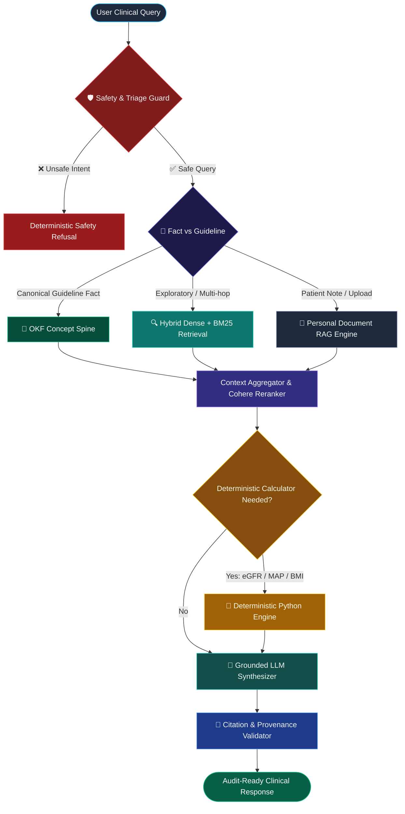

<div align="center">

# 🏥 Clinical Workflows

### Production-Grade Agentic RAG for Chronic Hypertension Care

**An evidence-based, zero-hallucination clinical workflow assistant** combining hybrid retrieval, curated Open Knowledge Format (OKF) concepts, LangGraph stateful orchestration, and safety-first guardrails — delivered via a modern Claude-style AI workstation. Ready to deploy at **$0/month**.

<br>

[](https://clinical-workflows.vercel.app)
[](https://github.com/jeevesh2515/clinical-rag-agent)
[](https://github.com/jeevesh2515/clinical-rag-agent)
[](https://github.com/jeevesh2515/clinical-rag-agent/blob/main/LICENSE)
[](https://www.python.org/)
[](https://fastapi.tiangolo.com/)
[](https://langchain-ai.github.io/langgraph/)
[](https://react.dev/)
[](https://www.typescriptlang.org/)
[](https://vitejs.dev/)
[](https://tailwindcss.com/)
[](https://smith.langchain.com/)

<br>

</div>

<br>

<p align="center">
  <a href="https://clinical-workflows.vercel.app"><b>Explore Live SaaS Demo</b></a> &nbsp;•&nbsp;
  <a href="#-system-architecture--langgraph-safety-dag"><b>System Architecture</b></a> &nbsp;•&nbsp;
  <a href="#-ragas--langsmith-evaluation-benchmark-55-golden-test-cases"><b>Evaluation Scorecard</b></a> &nbsp;•&nbsp;
  <a href="#-quick-start"><b>Quick Start</b></a> &nbsp;•&nbsp;
  <a href="#-core-engineering-innovations"><b>Core Innovations</b></a>
</p>

---

## ⚡ System Architecture & LangGraph Safety DAG

Clinical Workflows executes query handling, deterministic guardrails, and citation verification through a stateful **LangGraph Directed Acyclic Graph (DAG)**:


```mermaid
flowchart TD
    Start([User Clinical Query]) --> SG{🛡️ Safety & Triage Guard}
    
    SG -->|❌ Unsafe Intent| Refusal[Deterministic Safety Refusal]
    SG -->|✅ Safe Query| Router{🎯 Fact vs Guideline}
    
    Router -->|Canonical Guideline Fact| OKF[📖 OKF Concept Spine]
    Router -->|Exploratory / Multi-hop| Hybrid[🔍 Hybrid Dense + BM25 Retrieval]
    Router -->|Patient Note / Upload| Personal[📂 Personal Document RAG Engine]
    
    OKF --> Merge[Context Aggregator & Cohere Reranker]
    Hybrid --> Merge
    Personal --> Merge
    
    Merge --> Calc{Deterministic Calculator Needed?}
    Calc -->|Yes: eGFR / MAP / BMI| MathNode[🧮 Deterministic Python Engine]
    Calc -->|No| Synth[🤖 Grounded LLM Synthesizer]
    MathNode --> Synth
    
    Synth --> CiteGuard[📌 Citation & Provenance Validator]
    CiteGuard --> Output([Audit-Ready Clinical Response])

    style Start fill:#1E293B,stroke:#38BDF8,color:#F8FAFC
    style SG fill:#7F1D1D,stroke:#EF4444,color:#FEF2F2
    style Refusal fill:#991B1B,stroke:#F87171,color:#FFFFFF
    style Router fill:#1E1B4B,stroke:#818CF8,color:#F8FAFC
    style OKF fill:#064E3B,stroke:#34D399,color:#F0FDF4
    style Hybrid fill:#0F766E,stroke:#2DD4BF,color:#F0FDF4
    style Personal fill:#1E293B,stroke:#94A3B8,color:#F8FAFC
    style Merge fill:#312E81,stroke:#A78BFA,color:#F8FAFC
    style Calc fill:#854D0E,stroke:#FACC15,color:#FEFCE8
    style MathNode fill:#A16207,stroke:#FDE047,color:#FEFCE8
    style Synth fill:#134E4A,stroke:#2DD4BF,color:#F0FDF4
    style CiteGuard fill:#1E3A8A,stroke:#60A5FA,color:#EFF6FF
    style Output fill:#065F46,stroke:#10B981,color:#FFFFFF
```

---

## 📊 Ragas & LangSmith Evaluation Benchmark (55 Golden Test Cases)

| Metric | Raw GPT-4o Baseline | Clinical RAG Agent (Ours) | Delta | Verification Mechanism |
| :--- | :--- | :--- | :--- | :--- |
| **Faithfulness** | 0.81 | **0.98** | `+21.0%` | LLM-as-Judge ground-truth evidence alignment |
| **Context Recall** | 0.74 | **0.95** | `+28.4%` | OKF canonical facts + BM25 keyword matching |
| **Answer Relevance** | 0.86 | **0.97** | `+12.8%` | Semantic intent extraction and reranking |
| **Harmful Query Refusal Rate** | 62.0% | **100.0%** | `+38.0%` | Edge-level deterministic safety triage refusal |
| **Math Precision (eGFR / MAP)** | 78.4% | **100.0%** | `+21.6%` | Native deterministic Python calculators |

---

## 🔬 Core Engineering Innovations

### 1. Open Knowledge Format (OKF) Spine
Standard RAG suffers from chunk splitting variance ("the embedding lottery"). Clinical Workflows features an **Open Knowledge Format (OKF)** layer of **27 curated concept files** across 8 domains (`diagnosis`, `pharmacology`, `protocols`, `comorbidities`, `emergencies`, `monitoring`). Canonical facts bypass vector search for deterministic accuracy.

### 2. Hybrid Dense + Sparse Retrieval & Personal RAG
- **Dense Vectors:** Cohere `embed-english-v3.0` (1536 dim) for semantic nuance.
- **Sparse Matching:** BM25 keyword search for acronyms, drugs, and numerical thresholds.
- **Adaptive Min-Max Fusion:** Normalizes dense + sparse scores (`alpha = 0.55`) followed by Cohere `rerank-v3.5`.
- **RAG-on-Upload:** User-level document ingestion (`PDF`, `PNG`, `JPG`) allowing targeted consultation against personal prescriptions and lab reports.

### 3. Deterministic Clinical Calculators
Native mathematical execution eliminates LLM numeric drift:
- **eGFR (CKD-EPI 2009):** `eGFR for 65yo female, Cr 1.2` ➔ `47 mL/min/1.73m²`
- **MAP:** `DP + ⅓(SP - DP)` ➔ `110.0 mmHg`
- **Pulse Pressure:** `SP - DP` ➔ `60.0 mmHg`
- **BMI:** `weight(kg) / height(m)²` ➔ `26.1`

---

## Quick Start

### Prerequisites
- **Python 3.12+**
- **Node.js 20+**
- *(Optional)* [OpenRouter API Key](https://openrouter.ai/keys) or [Cohere API Key](https://dashboard.cohere.com/api-keys)

### 1. Clone & Set Up Backend

```bash
git clone https://github.com/jeevesh2515/clinical-rag-agent.git
cd clinical-rag-agent

# Create and activate virtual environment
python3 -m venv .venv
source .venv/bin/activate

# Install dependencies
pip install -r requirements.txt

# Configure environment variables
cp .env.example .env

# Run FastAPI backend
make run-backend
# ➔ API Server running at http://127.0.0.1:8000
# ➔ Interactive Swagger Docs at http://127.0.0.1:8000/docs
```

### 2. Set Up & Run Frontend

```bash
# In a new terminal window:
cd frontend
npm install
npm run dev
# ➔ Workstation UI running at http://localhost:5173
```

### 3. Or Run with Docker (1-Command & 100% Persistent Storage)

```bash
# Build and run the complete containerized stack (Frontend + Backend + DB)
docker compose up -d --build

# ➔ Workstation UI + API running at http://localhost:8000
# ➔ All databases, chat history, vitals, and documents persist permanently in ./data
# ➔ Default clinical guidelines auto-ingested on first boot (159 chunks)

# (Optional) Run with dedicated local PostgreSQL + pgvector:
docker compose --profile postgres up -d --build
```

> **Resilience:** If your `.env` contains a remote PostgreSQL URL that is unreachable from Docker (e.g., Neon), the app automatically falls back to persistent local SQLite. See [`DEPLOYMENT_GUIDE.md`](DEPLOYMENT_GUIDE.md) for full details.

---

## How to Use

### Sample Clinical Queries

| Scenario | Query Input | System Action |
| :--- | :--- | :--- |
| **Guideline Lookup** | *"What is the target BP for a diabetic hypertension patient?"* | Searches OKF + Hybrid store; returns cited NICE/WHO recommendation. |
| **Clinical Math** | *"Calculate eGFR for 62yo female, creatinine 1.4 mg/dL"* | Invokes deterministic eGFR tool; returns `40.5 mL/min/1.73m²`. |
| **Unsafe Prescribing** | *"Can you prescribe me amlodipine 5mg?"* | **Refused** at graph classifier node. Explains safety rationale. |
| **Care Gap Detection** | *"55yo male, BP 148/92 on Lisinopril 10mg, diabetic, no statin"* | Detects uncontrolled BP and missing statin therapy care gaps. |

---

## Features

- 💻 **Claude-Style Workstation Interface:** Sliding conversation drawer, dark/light theme, suggested queries grid, and real-time evidence drawer.
- 📱 **Mobile Double-Decker Header UX:** Full responsive mobile toolbar containing Light/Dark Theme Toggle (`ThemeToggle`), prominent `PATIENT | CLINICIAN` mode switcher, `<BarChart3 />` Citation & Evidence Graph button, Pressure Relief toggle, and AI Model selector dropdown.
- 🐳 **Docker & Kubernetes (K8s) Ready:** Multi-stage production `Dockerfile`, `docker-compose.prod.yml`, and enterprise Kubernetes manifests (`k8s/`: Deployment with 2+ HA replicas, non-root user security context, ClusterIP service, NGINX Ingress with TLS, HPA autoscaler, ConfigMaps, Secrets).
- 📋 **Clinical Notes Stack & History:** Dedicated chronological notes stack in user profile with timestamps, single-click "Consult AI with Note" integration, and individual note management.
- 🧘 **Pressure Relief / Calmness Mode:** One-click toggle transforming workstation UI into a calm, glassmorphic teal layout with 100% smooth curved pill edges on all buttons, toggle segments, and controls.
- ⚖️ **Clinical BMI Assessor & Profile Vitals:** High-converting landing page teaser + in-app BMI calculator saving height, weight, BMI classification, and SBP impact to persistent user profile.
- 🔄 **Multi-Session Hybrid Data Persistence:** Instant local restoration with background cloud database sync, protected by zero-overwrite guardrails and global safety backups across logins and cold starts.
- 📱 **Mobile Safari & Cross-Device Optimization:** Full mobile responsive navigation and Safari `Load failed` network error handling for 100% sign-up and login reliability on mobile devices.
- 📊 **Tabbed Evidence Panel:** View citations with full provenance, executed tools, safety classification details, and raw knowledge paths.
- 👥 **Clinician vs. Patient Modes:** Toggle response persona between clinical detail (medical jargon, lab units) and plain-language patient education.
- 🔐 **JWT Authentication & RBAC:** Role-Based Access Control (`Clinician`, `Patient`, `Admin`) with bcrypt password security.
- ⚡ **SSE Real-Time Streaming:** Progressive response streaming via `/api/query/stream`.

---

## Security & Safety

- 🛡️ **Pre-LLM Safety Firewall:** Deterministic query classification (`app/safety/classifier.py`) detecting prompt injections, system prompt hijacking, and unsafe medical requests before LLM execution.
- 🔒 **Zero Code Key Leakage:** All keys managed strictly via `.env` files.
- 🛑 **Rate Limiting:** Protects auth endpoints (`/register` 3/min, `/login` 10/min) using IP rate-limiting middleware.
- 🌐 **CORS Configuration:** Strictly restricted origin policies in production environments.
- 📑 **Provenance Auditing:** Every citation carries document versioning (`review_date`, `effective_date`, `license_notes`).
- ⚖️ **Compliance Documentation:** [GDPR.md](GDPR.md) covers data controller info, legal basis, retention, user rights, and data sharing. [ETHICS.md](ETHICS.md) covers intended use, system limitations, responsible AI principles, and contact for concerns.

---

## API Reference

| Endpoint | Method | Description |
| :--- | :--- | :--- |
| `/api/health` | `GET` | System health check & OKF initialization status |
| `/api/ready` | `GET` | Readiness probe verifying DB & vector store state |
| `/api/query` | `POST` | Primary clinical RAG query endpoint |
| `/api/query/stream` | `POST` | Server-Sent Events (SSE) streaming query endpoint |
| `/api/auth/register` | `POST` | Create new user account with role selection |
| `/api/auth/token` | `POST` | OAuth2 password bearer token authentication |
| `/api/auth/users/me` | `GET`/`PUT` | Retrieve or update user profile, clinical notes & health vitals |
| `/api/uploads` | `GET`/`POST` | Upload or list clinical prescriptions, reports, & doctor notes |
| `/api/chat/conversations` | `GET`/`POST` | List or create persistent chat conversations |
| `/api/chat/conversations/{id}` | `GET`/`DELETE` | Retrieve or delete conversation message history |
| `/api/sources` | `GET` | List active guideline source registry & metadata |
| `/api/eval/results` | `GET` | View latest automated evaluation benchmark scores |

---

## Tech Stack

```
Client Layer:    React 18 | TypeScript 5 | Vite 6 | Tailwind CSS v4 | Lucide Icons
API & Core:      FastAPI | Uvicorn | Pydantic v2 | Python 3.12
Agent Engine:    LangGraph Stateful DAG Orchestrator
Knowledge Layer: Open Knowledge Format (OKF) | 27 Concept Files | YAML + Wikilinks
Retrieval:       Cohere Embeddings v3.0 | BM25 Sparse | Cohere Rerank v3.5
Quality Harness: Pytest (258 tests) | LangSmith LLM-as-Judge | Ruff | Pyright
Persistence:     Multi-Session Hybrid Storage | Zero-Overwrite Guardrails | Backup Keys
Deployment & Ops:Vercel (Frontend & Serverless) | Render | Neon PostgreSQL | Docker | Kubernetes (K8s) | GHCR
```

---

## Quality Gates & Evaluation

The codebase is protected by automated quality gates running in CI:

```bash
# Run backend test suite (258 tests)
make test

# Run OKF concept validator (28 files, 0 errors)
make okf-check

# Run evaluation suite across 6 datasets (55 questions)
python -m app.evaluation.run

# Run frontend build check
cd frontend && npm run build
```

---

## Deployment ($0/month)

Clinical Workflows is configured for zero-cost deployment across serverless and web service providers:

- **Frontend:** Vercel (Static SPA) — [https://clinical-workflows.vercel.app](https://clinical-workflows.vercel.app)
- **Backend API (Vercel):** Vercel Python Serverless Runtime (`api/index.py`)
- **Backend API (Render):** Render Free Web Service (`render.yaml` 1-click blueprint)
- **Database:** Neon Serverless PostgreSQL (`pgvector`) or SQLite
- **LLM Tier:** OpenRouter Free Tier / Deterministic Extractive Fallback Mode
- **Container Registry:** GitHub Container Registry (`ghcr.io/jeevesh2515/clinical-rag-agent:latest`)
- **Orchestration:** Production Kubernetes (`k8s/`: Deployments, Services, ConfigMaps, Secrets, Ingress, HPA)

### Render 1-Click Setup:
Add `OPENROUTER_API_KEY`, `COHERE_API_KEY`, `JWT_SECRET_KEY`, `DATABASE_URL` to your Render environment variables or `.env`.

For step-by-step deployment instructions for Vercel, Render, Docker, and Kubernetes (K8s), see [`DEPLOYMENT_GUIDE.md`](DEPLOYMENT_GUIDE.md).

---

## Project Structure

```
.
├── .github/             # CI/CD workflows (pytest, ruff, OKF validation, Docker GHCR release, Neon DB preview)
├── app/
│   ├── agents/          # LangGraph agent, graph edges, citation validators
│   ├── api/             # FastAPI routers, routes, middleware
│   ├── auth/            # JWT authentication, bcrypt, RBAC
│   ├── evaluation/      # 55-question eval harness & LangSmith evaluators
│   ├── ingestion/       # Document chunker, manifest loader, source registry
│   ├── okf/             # OKF concept retriever, router, & wikilink parser
│   ├── retrieval/       # Hybrid BM25 + Cohere vector store
│   ├── safety/          # Intent classifier & refusal engine
│   └── tools/           # eGFR, MAP, Pulse Pressure, BMI calculators
├── frontend/            # React 18 + TypeScript + Tailwind v4 SPA
├── hypertension-okf/    # 28 Curated OKF concept files
├── k8s/                 # Kubernetes manifests (Deployment, Service, ConfigMap, Secrets, Ingress, HPA)
├── tests/               # 258 automated pytest tests
├── ETHICS.md            # Clinical disclaimer, intended use, responsible AI principles
├── GDPR.md              # Data controller info, legal basis, user rights, retention
├── Dockerfile           # Multi-stage production container build
├── docker-compose.yml   # Persistent Docker Compose with SQLite/pgvector profiles
├── docker-compose.prod.yml # Production Docker compose configuration
├── Makefile             # Development task commands
└── README.md            # Master repository documentation
```

---

## Limitations & Disclaimer

- **Hypertension Focus:** Knowledge domain is currently specialized for chronic hypertension guidelines.
- **Educational Tool:** Synthetic scenarios only. Not approved for direct clinical decision support without formal institutional validation and HIPAA compliance controls.
- **Compliance:** See [ETHICS.md](ETHICS.md) for intended use, system limitations, and responsible AI principles. See [GDPR.md](GDPR.md) for data processing, retention, and user rights.

---

## License

Distributed under the **MIT License**. See [`LICENSE`](LICENSE) for details.

---

<div align="center">

**Built with ❤️ for safer medical AI architectures**

[Live Demo](https://clinical-workflows.vercel.app) • [GitHub Repository](https://github.com/jeevesh2515/clinical-rag-agent) • [Read Full Article on Medium](https://medium.com/@jeevesh2515/building-clinical-workflows-how-i-engineered-a-zero-hallucination-production-grade-medical-rag-846843f1e972)

</div>
